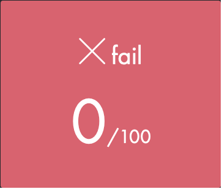

## C PISCINE AUGUST 2021

| Module | Shell | C | Rush |
| ------ | ------ | ------ | ------ |
| 00 |  |  |  |
| 01 | [plugins/github/README.md][PlGh] |
| 02 | [plugins/googledrive/README.md][PlGd] |
| 03 | [plugins/onedrive/README.md][PlOd] |
| 04 | [plugins/medium/README.md][PlMe] |
| 05 | [plugins/googleanalytics/README.md][PlGa] |
