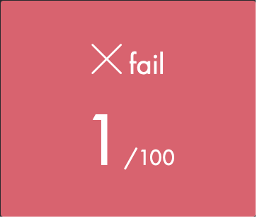

## C PISCINE AUGUST 2021

| Module | Shell | C | Rush |
| ------ | ------ | ------ | ------ |
| 00 | [

](https://github.com/passionroro/42-C_Piscine/tree/master/Shell/00) | [

](https://github.com/passionroro/42-C_Piscine/tree/master/C/00) | [

](https://github.com/passionroro/42-C_Piscine/tree/master/Rush/00) |
| 01 | [

](https://github.com/passionroro/42-C_Piscine/tree/master/Shell/01) | [

](https://github.com/passionroro/42-C_Piscine/tree/master/C/01) | [

](https://github.com/passionroro/42-C_Piscine/tree/master/Rush/01) |
| 02 | | [

](https://github.com/passionroro/42-C_Piscine/tree/master/C/02) | [

](https://github.com/passionroro/42-C_Piscine/tree/master/Rush/02) |
| 03 | | [

](https://github.com/passionroro/42-C_Piscine/tree/master/C/03) | |
| 04 | | [

](https://github.com/passionroro/42-C_Piscine/tree/master/C/04) | |
| 05 | | [

](https://github.com/passionroro/42-C_Piscine/tree/master/C/05) | |
| 06 | | [

](https://github.com/passionroro/42-C_Piscine/tree/master/C/06) | |
| 07 | | [

](https://github.com/passionroro/42-C_Piscine/tree/master/C/07) | |
| 08 | | [

](https://github.com/passionroro/42-C_Piscine/tree/master/C/08) | |